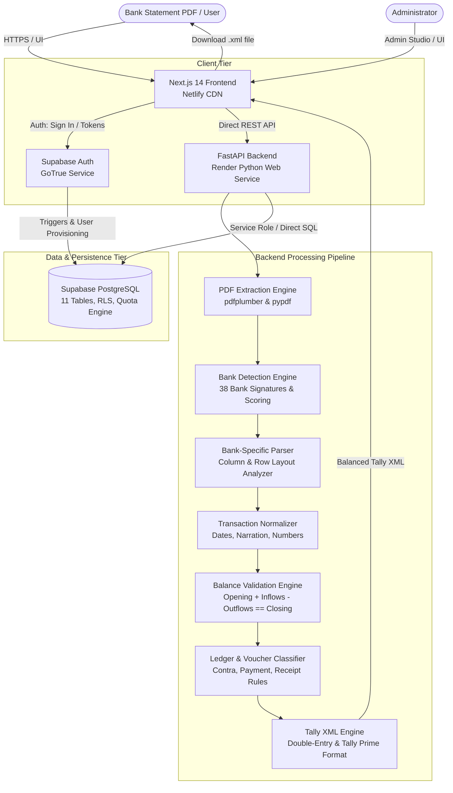
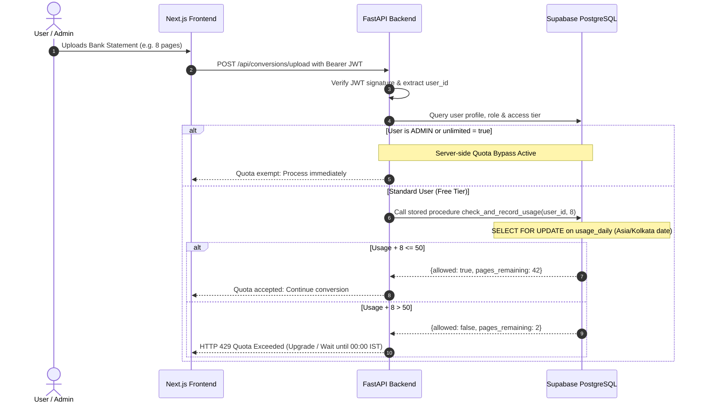

# Technical Architecture & System Design
**Kangra Hub Free Tally XML**

This document details the complete end-to-end architecture, data flows, security boundaries, and accounting integrity guarantees of Kangra Hub Free Tally XML.

---

## 1. High-Level Architecture Diagram



---

## 2. End-to-End Conversion Pipeline

```
PDF Bank Statement
    │
    ▼ (1) PDF Inspection & Extraction
    - Extract text, character coordinates, and table bounding boxes.
    - Check for password protection and structural validity.
    │
    ▼ (2) Multi-Attribute Bank Detection
    - Scan headers, footers, IFSC codes, web domains, and account patterns against 38 banks.
    - Weighted scoring assigns confidence percentage (0 - 100%).
    - Flag as AMBIGUOUS if score gap between top two banks is under threshold.
    │
    ▼ (3) Specialized Parser Execution
    - Dispatches to custom parser (e.g. SBI, HDFC, ICICI, Axis, PNB, Kotak, Canara, etc.).
    - Isolates table headers, transaction rows, multi-line narrations, and continuation blocks.
    │
    ▼ (4) Transaction Normalization
    - Clean date formats into ISO standard (`YYYY-MM-DD`).
    - Clean currency numbers (stripping commas, currency symbols, and trailing Dr/Cr markers).
    - Map debits (withdrawals/outflows) and credits (deposits/inflows).
    │
    ▼ (5) Mathematical Balance Validation (ZERO SILENT DATA LOSS)
    - Verify formula: Opening Balance + Total Credits - Total Debits == Closing Balance.
    - Continuous running balance verification per row.
    - If discrepancy != 0.00: Mark status as 'MISMATCH', highlight suspect rows in UI, and BLOCK automatic XML download.
    │
    ▼ (6) Ledger Mapping & Voucher Classification
    - Rules match narration against regex and keyword patterns.
    - Classify into Tally Voucher Types:
      * Contra: Cash withdrawals (`ATM WDL`, `CASH WDL`), Cash deposits, Self-transfers.
      * Payment: Debits / Outflows to third parties (UPI, NEFT, RTGS, POS, Charges).
      * Receipt: Credits / Inflows from third parties (Salary, Dividends, UPI deposits).
    │
    ▼ (7) Double-Entry Tally XML Generation
    - Generates strict Tally Prime / Tally 9 compatible `<ENVELOPE>` and `<TALLYMESSAGE>` XML.
    - Guaranteed double entry:
      * Ledger 1 (Bank Account): Dr for Receipts, Cr for Payments.
      * Ledger 2 (Party / Contra Ledger): Cr for Receipts, Dr for Payments.
      * Total Debits == Total Credits down to the exact paisa (₹0.00 difference).
```

---

## 3. Quota & Entitlement Architecture



---

## 4. Admin Converter & Manual Override Architecture

In the dedicated Admin Console (`/admin/convert`):
- **Server-Side Quota Exemption**: Calls `/admin/conversions/upload`, completely bypassing quota deduction.
- **Deep Candidate Scoring**: Returns the top 3 matched candidate banks with individual signature weights and scoring rationales.
- **Manual Bank Override**:
  - If a statement is misidentified or ambiguous, the administrator can select the target bank parser from a dropdown.
  - Calling `POST /admin/conversions/{job_id}/override-bank` switches the parser and re-runs extraction.
  - The job is tagged with an amber `MANUALLY OVERRIDDEN` audit banner and recorded in `public.audit_logs`.
- **Strict Financial Guardrails**: Even with admin privileges, if `balance_status == "MISMATCH"` or discrepancy > ₹0.00, generating XML is blocked with HTTP 400 until the balance is resolved.

---

## 5. Security & Isolation Matrix

| Component | Protection Mechanism |
|---|---|
| **Authentication** | Supabase GoTrue Auth issuing signed JWT tokens with standard 1-hour expiration |
| **Authorization** | Server-side role inspection on every privileged endpoint (`/admin/*`) |
| **Data Protection** | PostgreSQL Row Level Security (RLS) on all 11 tables |
| **API Transport** | Strict TLS/HTTPS required in staging and production |
| **CORS Policy** | Explicit origin whitelisting in FastAPI middleware |
| **File Safety** | In-memory stream validation, maximum 25 MB file size limit, and automatic temporary file unlinking |
